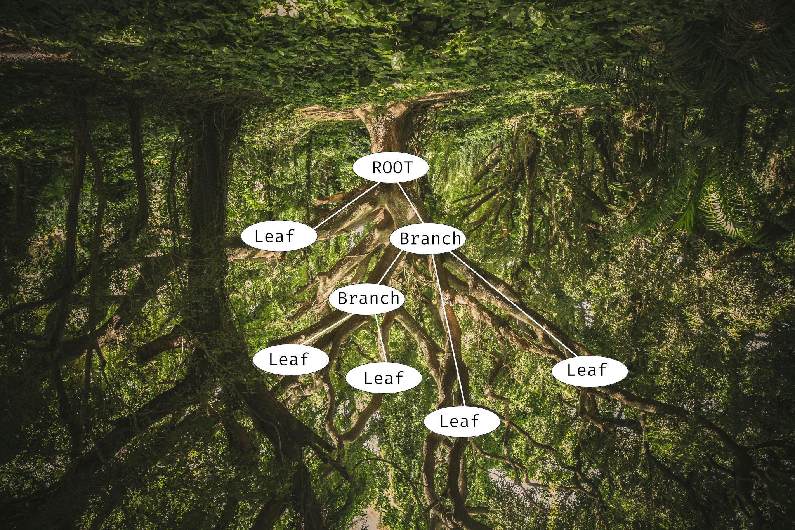
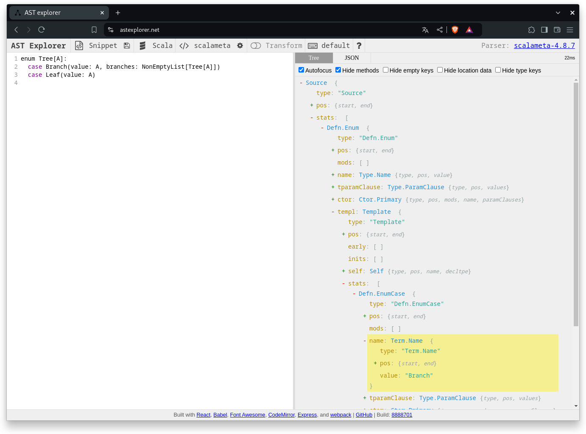
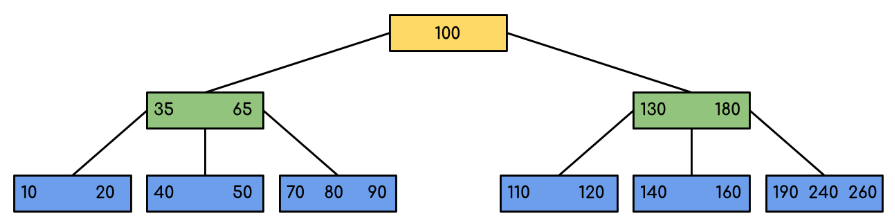
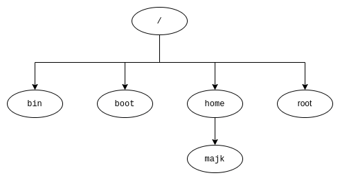
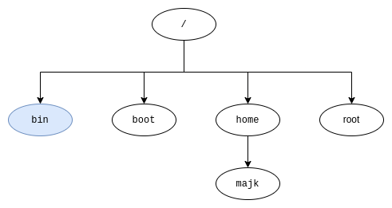
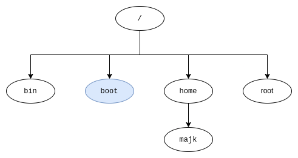
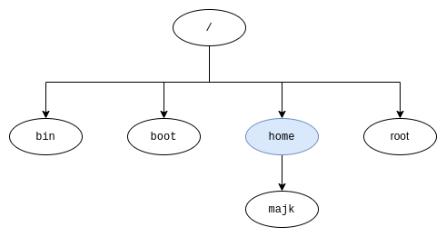
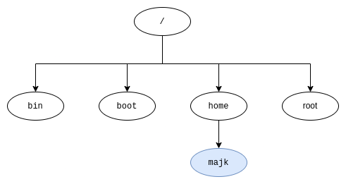
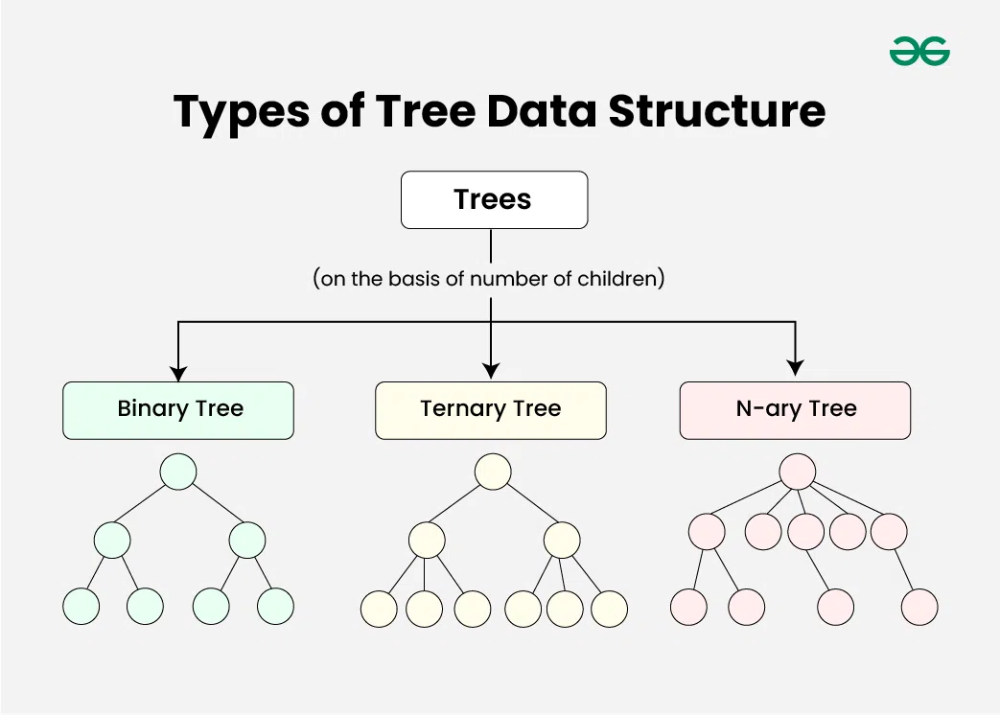

<!-- _transition: fade -->

---

<!-- _transition: fade -->


# What does the functor do on the tree?

<!-- 


# Path for today

1) Model a `Tree` with `ADT`
 * what is a tree
 * normal people see birds or cats on trees
 * our trees are upside down
 * and if we have a really close look, we can see a functor on them
2) Identify the `Functor` on the `Tree`
3) Everyday `Tree` in IT
 * Source code
 * Filesystem and the `tree` command
4) Drawing our own tree
 * Goal: draw a timeline of WSUG
   * First just edition names + times
   * Then subtrees with topics and authors
   * Then sub-subtrees with author details like website or socials
 * Depth first - functional approach
 * Breadth-first - imperative
 * Compile it together
 * Homework: Okasaki structure for FP breadth-first -->


<!-- 


# Path for today

1) Model a `Tree` with `ADT`
2) Identify the `Functor` on the `Tree`
3) Everyday `Tree` in IT
4) Draw yourself a `Tree` -->

<!-- _transition: fade -->

---
<!-- _transition: fade -->


---
<!-- _transition: fade -->

# When a regular person goes into the woods

they can spot...


---
<!-- _transition: fade -->


---
<!-- _transition: fade -->


---
<!-- _transition: fade -->

# But if **you** look carefully


---
<!-- _transition: fade -->


---
<!-- _transition: fade -->


---


---

<!-- _transition: fade -->

# But first things first


---

<!-- _transition: drop -->


---
<!-- _transition: fade -->


---

# That's better!



---

# Let's model this

---

# Tree

<!-- _class: line-numbers -->

```scala
enum Tree[A]:
  case Branch(value: A, branches: NonEmptyList[Tree[A]])
  case Leaf(value: A)
```

---

# Now what?

How's that useful?

---

# Programming languages 🌳

The compiler parses your text file and produces an Abstract Syntax Tree (AST)

- Allow you to analyze and manipulate the syntactic structure of programs
- Useful in meta-programming


---

# AST




---

# Databases 🌳

Self-balancing tree called *B-tree* is a popular way to implement indexing in databases




<!-- _footer: Source: https://www.geeksforgeeks.org/introduction-of-b-tree-2/ -->


---

# File system 🌳

- `/` is the `Root`
- Directories are branches
- Files are leaves

---

# Files tree

```bash
.
├── build.sbt
├── docs
│   └── markdown
│       ├── contributing
│       │   ├── how-it-works.md
│       │   ├── index.md
│       │   └── supporting-a-test-framework.md
│       ├── custom-types-support.md
│       └── supported-frameworks.md
├── LICENSE
├── modules
│   ├── core
│   ├── hashing
│   ├── munit
│   ├── plugin
│   ├── scalatest
│   └── weaver
├── project
│   ├── build.properties
│   ├── plugins.sbt
│   ├── project
│   └── Versions.scala
├── README.md
└── website
    ├── babel.config.js
    ├── docs
    ├── docusaurus.config.ts
    └── static
        └── img
            ├── favicon.ico
            ├── logo-large.png
            ├── logo-medium.png
            └── logo-small.png
```

---

# Wait that looked quite nice 🤔

---

# Wait that looked quite nice 🤔

How about we implement a renderer like this for our tree?

---

# Goal 🥅

Draw a tree of meetup editions with topics as sub-trees 🌳 and speaker info as leafs 🍀

<!-- TODO make a slide with showcasing the expected result -->

---

# Renderer

<!-- _class: line-numbers -->

```scala
trait Renderer {
  // `Show` means that we can turn `A` into a nice `String`
  def render[A: Show](tree: Tree[A]): String
}
```
---

# Baby steps 👶

Let's start with drawing this:
```bash
/
├── bin
├── boot
├── etc
├── home
├── root
├── usr
└── var
```

---

# Test


```scala
  test("should render a simple tree") {
    val oneLevelTree: Tree[String] =
      Branch(
        "/",
        NonEmptyList
          .of("bin", "boot", "etc", "home", "root", "usr", "var")
          .map(Leaf(_))
      )

    assertInlineSnapshot(
      renderer.render(oneLevelTree),
      """/
        |├── bin
        |├── boot
        |├── etc
        |├── home
        |├── root
        |├── usr
        |└── var""".stripMargin
    )
  }

```

---

# Renderer

<!-- _class: line-numbers -->

```scala
  def render[A: Show](tree: Tree[A]): String =
    tree match {
      case Tree.Branch(value, branches) =>
        val renderedBranches =
          branches
            .map(render(_))
            .toList
            .mkString("\n")
        show"$value\n$renderedBranches"

      case Tree.Leaf(value) => show"├── $value"
    }
```

---

# Let's test it!

---

# Snapshot test result

```diff
Snapshot not equal
=> Obtained
/
├── bin
├── boot
├── etc
├── home
├── root
├── usr
├── var
=> Diff (- obtained, + expected)
 ├── usr
-├── var
+└── var
```

---

# The missing `└──`

---

# RendererV2

<!-- _class: line-numbers -->

```scala
  def render[A: Show](tree: Tree[A]): String =
    renderRecursive(tree, true)

  private def renderRecursive[A: Show](tree: Tree[A], isLast: Boolean): String =
    tree match {
      case Tree.Branch(value, branches) =>
        val allButLast = branches.init.map(
          renderRecursive(_, isLast = false)
        )
        val lastBranch = renderRecursive(
          branches.last,
          isLast = true
        )
        val renderedBranches = (allButLast :+ lastBranch).mkString("\n")
        show"$value\n$renderedBranches"

      case Tree.Leaf(value) =>
        if (isLast) show"└── $value"
        else show"├── $value"
    }
```

---

# Test again


```scala
  test("should render a simple tree") {
    val oneLevelTree: Tree[String] =
      Branch(
        "/",
        NonEmptyList
          .of("bin", "boot", "etc", "home", "root", "usr", "var")
          .map(Leaf(_))
      )

    assertInlineSnapshot(
      renderer.render(oneLevelTree),
      """/
        |├── bin
        |├── boot
        |├── etc
        |├── home
        |├── root
        |├── usr
        |└── var""".stripMargin
    )
  }
```

---

# So far so good!

```bash
RendererV2Test:
  + should render a simple tree 0.266s
```

---

# Nesting 🪜

Can we handle nested structures?

---

# Nesting 🪜

Can we handle nested structures?

```bash
/
├── bin
├── boot
├── etc
├── home
│   └── majk
├── root
├── usr
└── var
```

---

# Let's test it

```scala
  test("should render a simple tree") {
    val oneLevelTree: Tree[String] =
      Branch(
        "/",
        NonEmptyList
          .of(
            Leaf("bin"),
            Leaf("boot"),
            Leaf("etc"),
            Branch("home", NonEmptyList.one(Leaf("majk"))),
            Leaf("root"),
            Leaf("usr"),
            Leaf("var")
          )
      )

    assertInlineSnapshot(
      renderer.render(oneLevelTree),
      """/
        |├── bin
        |├── boot
        |├── etc
        |├── home
        |│   └── majk
        |├── root
        |├── usr
        |└── var""".stripMargin
    )
  }
```

---

# Not quite!

```diff
Snapshot not equal
=> Obtained
/
├── bin
├── boot
├── etc
home
└── majk
├── root
├── usr
└── var
=> Diff (- obtained, + expected)
 ├── etc
-home
-└── majk
+├── home
+│   └── majk
 ├── root
```

---

# Back to the source code

<!-- _class: line-numbers -->

```scala
  def render[A: Show](tree: Tree[A]): String =
    renderRecursive(tree, true)

  private def renderRecursive[A: Show](tree: Tree[A], isLast: Boolean): String =
    tree match {
      case Tree.Branch(value, branches) =>
        val allButLast = branches.init.map(
          renderRecursive(_, isLast = false)
        )
        val lastBranch = renderRecursive(
          branches.last,
          isLast = true
        )
        val renderedBranches = (allButLast :+ lastBranch).mkString("\n")
        show"$value\n$renderedBranches"

      case Tree.Leaf(value) =>
        if (isLast) show"└── $value"
        else show"├── $value"
    }
```


---

# Depth-first search


<!-- _footer: Source: https://en.wikipedia.org/wiki/Depth-first_search -->

<!-- draw the tree from the example above and show how when visiting `majk` leaf we don't know if there are other nodes on the upper level -->


---

# Depth-first search

<!-- _class: line-numbers -->

```scala
  def render[A: Show](tree: Tree[A]): String =
    tree match {
      case Tree.Branch(value, branches) =>
        val renderedBranches =
          branches
            .map(render(_))
            .toList
            .mkString("\n")
        show"$value\n$renderedBranches"

      case Tree.Leaf(value) => show"├── $value"
    }
```


<!-- _footer: Source: https://en.wikipedia.org/wiki/Depth-first_search -->

<!-- draw the tree from the example above and show how when visiting `majk` leaf we don't know if there are other nodes on the upper level -->


---

# Is this strategy good enough anyway?

---
<!-- _transition: fade -->
# Step by step

Let's do depth first search on a simplified tree

```bash
/
├── bin
├── boot
├── home
│   └── majk
└── root
```



---
<!-- _transition: fade -->
# Step by step

```bash
/
├── bin
...
```



---
<!-- _transition: fade -->
# Step by step

```bash
/
├── bin
├── boot
...
```



---
<!-- _transition: fade -->
# Step by step

```bash
/
├── bin
├── boot
├── home
...
```



---

# Step by step

```bash
/
├── bin
├── boot
├── home
❓  └── majk
```
🤔 what should the first character be?




---

# Limitations of DFS

* We want to draw trees in depth-first manner, but we lack information about the structure
* We need to learn the tree width first, before deciding how to print nodes

---
<!-- _transition: fade -->

# Breadth-first search


<!-- _footer: Source https://en.wikipedia.org/wiki/Breadth-first_search -->

---

# Breadth-first search

**Black:** explored

**Grey:** queued to be explored later on

* You got this right, we're introducing a mutable queue 😲


<!-- _footer: Source https://en.wikipedia.org/wiki/Breadth-first_search -->

---

# Basic BFS

```scala

  def breadthFirstList[A](root: Tree[A]): List[A] = {
    val q = Queue.empty[Tree[A]]
    val results = ListBuffer.empty[A]
    q.enqueue(root)
```
🙈
```scala
          results.append(value)
    }
    results.toList
```

---

# Basic BFS

<!-- _class: line-numbers -->

```scala
  def breadthFirstList[A](root: Tree[A]): List[A] = {
    val q = Queue.empty[Tree[A]]
    val results = ListBuffer.empty[A]
    q.enqueue(root)
    while (q.nonEmpty) {
      val node = q.dequeue()
      println(f"Visiting ${node.getValue}%5s, queue: ${q.map(_.getValue)}")
      node match
        case Tree.Branch(value, branches) =>
          results.append(value)
          q.enqueueAll(branches.toList)
        case Tree.Leaf(value) =>
          results.append(value)
    }
    results.toList
  }
```

---

# Let's test it

```scala

  test("should visit nodes in expected order") {
    val oneLevelTree: Tree[String] =
      Branch(
        "/",
        NonEmptyList
          .of(
            Leaf("bin"),
            Leaf("boot"),
            Leaf("etc"),
            Branch("home", NonEmptyList.one(Leaf("majk"))),
            Leaf("root"),
            Leaf("usr"),
            Leaf("var")
          )
      )

    assertInlineSnapshot(
      BFS.breadthFirstList(oneLevelTree),
      List("/", "bin", "boot", "etc", "home", "root", "usr", "var", "majk")
    )
  }
```

---

# Let's see it in action

```scala
sbt:root> testOnly *BFS*
Visiting     /, queue: Queue()
Visiting   bin, queue: Queue(boot, etc, home, root, usr, var)
Visiting  boot, queue: Queue(etc, home, root, usr, var)
Visiting   etc, queue: Queue(home, root, usr, var)
Visiting  home, queue: Queue(root, usr, var)
Visiting  root, queue: Queue(usr, var, majk)
Visiting   usr, queue: Queue(var, majk)
Visiting   var, queue: Queue(majk)
Visiting  majk, queue: Queue()
BFSTest:
  + should visit nodes in expected order 0.124s
[info] Passed: Total 1, Failed 0, Errors 0, Passed 1
```

---

# So far so good, ordering makes sense

Now let's attach some info along the way

---

# Node positioning

```scala
  enum Position {
    case First
    case Middle
    case Last
  }
```

---

# Node positioning

```scala
  enum Position {
    case First
    case Middle
    case Last
  }
```

```scala
  def labelNodes[A](root: Tree[A]): List[(A, List[Position])] = {
```

---

# Extended queue and result type

```scala
  def labelNodes[A](root: Tree[A]): List[(A, List[Position])] = {
    val q = Queue.empty[(Tree[A], List[Position])]
    val results = ListBuffer.empty[(A, List[Position])]
    q.enqueue((root, List.empty))
    while (q.nonEmpty) {
```

```scala
          results.append((value, positions))
    }
    results.toList
```


---

# Extended queue and result type

```scala
    while (q.nonEmpty) {
      val (node, positions) = q.dequeue()
      node match
        case Tree.Branch(value, branches) =>
          val branchesWithPositions =
            attachPositions(positions)(branches.toList)
          results.append((value, positions))
          q.enqueueAll(branchesWithPositions)
        case Tree.Leaf(value) =>
          results.append((value, positions))
```


---

# Extended queue and result type

```scala
    while (q.nonEmpty) {
      val (node, positions) = q.dequeue()
      node match
        case Tree.Branch(value, branches) =>
          val branchesWithPositions =
            attachPositions(positions)(branches.toList)
          results.append((value, positions))
          q.enqueueAll(branchesWithPositions)
        case Tree.Leaf(value) =>
          results.append((value, positions))
```

```scala

  private def attachPositions[A](parantPositions: List[Position])(
      branches: List[Tree[A]]
  ): List[(Tree[A], List[Position])] =
    branches.zipWithIndex.map { case (tree, index) =>
      (tree, parantPositions.appended(calculatePosition(index, branches.size)))
```

---

# Let's test it

```scala

  test("should produce extended positions") {
    assertInlineSnapshot(
      BFSExtended.labelNodes(oneLevelTree),
      List(
        ("/", List()),
        ("bin", List(First)),
        ("boot", List(Middle)),
        ("etc", List(Middle)),
        ("home", List(Middle)),
        ("root", List(Middle)),
        ("usr", List(Middle)),
        ("var", List(Last)),
        ("majk", List(Middle, Last))
      )
    )
  }
```

<!-- NOTE: we are not handling duplicates here, that's a bonus question -->

---

# Works like a charm

```scala
BFSTest:
  + should visit nodes in expected order 0.078s
  + should produce paddings 0.018s
  + should produce extended positions 0.007s
```

---

# We are ready


---

# Final challenge

Let's implement `RendererV3` 🚀


---

# Bonus

B-trees https://planetscale.com/blog/btrees-and-database-indexes

<!-- 

https://www.geeksforgeeks.org/introduction-to-tree-data-structure/
 -->