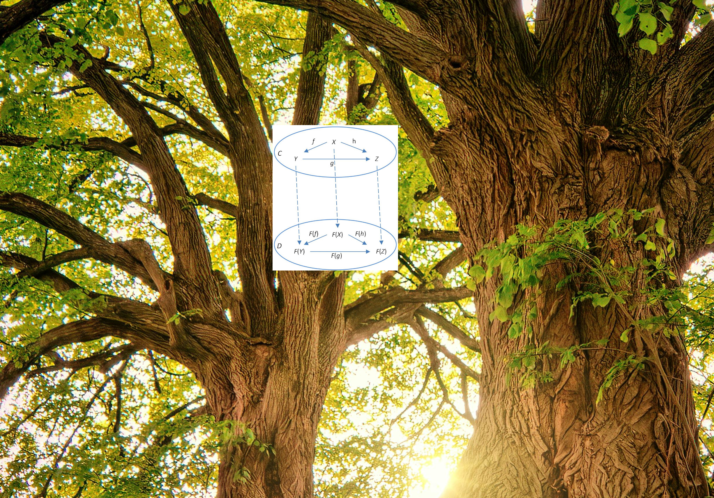

<!-- _transition: fade -->

---

<!-- _transition: fade -->


# What does the functor do on the tree?

<!-- 


# Path for today

1) Model a `Tree` with `ADT`
 * what is a tree
 * normal people see birds or cats on trees
 * our trees are upside down
 * and if we have a really close look, we can see a functor on them
2) Identify the `Functor` on the `Tree`
3) Everyday `Tree` in IT
 * Source code
 * Filesystem and the `tree` command
4) Drawing our own tree
 * Goal: draw a timeline of WSUG
   * First just edition names + times
   * Then subtrees with topics and authors
   * Then sub-subtrees with author details like website or socials
 * Depth first - functional approach
 * Breadth-first - imperative
 * Compile it together
 * Homework: Okasaki structure for FP breadth-first -->


<!-- 


# Path for today

1) Model a `Tree` with `ADT`
2) Identify the `Functor` on the `Tree`
3) Everyday `Tree` in IT
4) Draw yourself a `Tree` -->

<!-- _transition: fade -->

---
<!-- _transition: fade -->


---
<!-- _transition: fade -->

# When a regular person goes into the woods

they can spot...


---
<!-- _transition: fade -->


---
<!-- _transition: fade -->


---
<!-- _transition: fade -->

# But if **you** look carefully


---
<!-- _transition: fade -->


---
<!-- _transition: fade -->


---



---

<!-- _transition: fade -->

# But first things first


---

<!-- _transition: drop -->


---
<!-- _transition: fade -->


---

# That's better!


---

# Let's model this

---

# Tree

<!-- _class: line-numbers -->

```scala

enum Tree[A] {
  case Branch(value: A, branches: NonEmptyList[Tree[A]])
```

---

# Now what?

How's that useful?

---

# Programming languages 🌳

The compiler parses your text file and produces an Abstract Syntax Tree (AST)

- Allow you to analyze and manipulate the syntactic structure of programs
- Useful in meta-programming


---

# AST


---

# Databases 🌳

Self-balancing tree called *B-tree* is a popular way to implement indexing in databases


<!-- _footer: Source: https://www.geeksforgeeks.org/introduction-of-b-tree-2/ -->


---

# File system 🌳

- `/` is the `Root`
- Directories are branches
- Files are leaves

---

# Files tree

```bash
.
├── build.sbt
├── docs
│   └── markdown
│       ├── contributing
│       │   ├── how-it-works.md
│       │   ├── index.md
│       │   └── supporting-a-test-framework.md
│       ├── custom-types-support.md
│       └── supported-frameworks.md
├── LICENSE
├── modules
│   ├── core
│   ├── hashing
│   ├── munit
│   ├── plugin
│   ├── scalatest
│   └── weaver
├── project
│   ├── build.properties
│   ├── plugins.sbt
│   ├── project
│   └── Versions.scala
├── README.md
└── website
    ├── babel.config.js
    ├── docs
    ├── docusaurus.config.ts
    └── static
        └── img
            ├── favicon.ico
            ├── logo-large.png
            ├── logo-medium.png
            └── logo-small.png
```

---

# Wait that looked quite nice 🤔

---

# Wait that looked quite nice 🤔

How about we implement a renderer like this for our tree?

---

# Goal 🥅

Draw a tree of meetup editions with topics as sub-trees 🌳 and speaker info as leafs 🍀

<!-- TODO make a slide with showcasing the expected result -->

---

# Goal 🥅

```bash
 Wrocław Scala User Group
├── 📅 15.05.2024 Meeting #10
│  ├── 🎤 All the things that Metals doesn't do
│  │  └── 🧍 Katarzyna Marek 🌐 https://www.linkedin.com/in/katarzyna-marek-a74790193
│  └── 🎤 Grackle - Scala GraphQL Server
│     └── 🧍Rafał Piotrowski 🌐 https://www.linkedin.com/in/rafalpiotrowski
├── 📅 2.07.2024 Meeting #11
│  ├── 🎤 Human(o)IDs — designing IDs for both machines AND humans
│  │  └── 🧍 Jakub Wojnowski 🌐 https://www.linkedin.com/in/jakub-wojnowski
│  └── 🎤 Scala 3 features you probably haven't used (yet)
│     └── 🧍   Kacper Korban 🌐 https://www.linkedin.com/in/kacperfkorban
└── 📅 17.09.2024 Meeting #12
   ├── 🎤 What does the functor do on the tree?
   │  └── 🧍   Michał Pawlik 🌐 https://michal.pawlik.dev
   └── 🎤 Gearing towards Ox: A look at structured concurrency and direct style Scala
      └── 🧍   Tomasz Godzik 🌐 https://twitter.com/TomekGodzik
```

---

# But how 🤔

* Renderer capable of drawing **simple** structure
* Renderer capable of drawing **nested** structure
* Model meetup details
* Render tree with meetup details

---

# Renderer

<!-- _class: line-numbers -->

```scala
trait Renderer {
  def render(tree: Tree[String]): String
}
```
---

# Baby steps 👶

Let's start with drawing this:
```bash
/
├── bin
├── boot
├── etc
├── home
├── root
├── usr
└── var
```

---

# Test


```scala
  test("should render a simple tree".ignore) {
    val oneLevelTree: Tree[String] =
      Branch(
        "/",
        NonEmptyList
          .of("bin", "boot", "etc", "home", "root", "usr", "var")
          .map(Leaf(_))
      )

    assertInlineSnapshot(
      renderer.render(oneLevelTree),
      """/
        |├── bin
        |├── boot
        |├── etc
        |├── home
        |├── root
        |├── usr
        |└── var""".stripMargin
    )
  }

```

---

# Renderer

<!-- _class: line-numbers -->

```scala
  def render(tree: Tree[String]): String =
    tree match {
      case Tree.Branch(value, branches) =>
        val renderedBranches =
          branches
            .map(render(_))
            .toList
            .mkString("\n")
        show"$value\n$renderedBranches"

      case Tree.Leaf(value) => show"├── $value"
    }
```

---

# Let's test it!

---

# Snapshot test result

```diff
Snapshot not equal
=> Obtained
/
├── bin
├── boot
├── etc
├── home
├── root
├── usr
├── var
=> Diff (- obtained, + expected)
 ├── usr
-├── var
+└── var
```

---

# The missing `└──`

---

# RendererV2

<!-- _class: line-numbers -->

```scala
  def render(tree: Tree[String]): String =
    renderRecursive(tree, true)

  private def renderRecursive[A: Show](tree: Tree[A], isLast: Boolean): String =
    tree match {
      case Tree.Branch(value, branches) =>
        val allButLast = branches.init.map(
          renderRecursive(_, isLast = false)
        )
        val lastBranch = renderRecursive(
          branches.last,
          isLast = true
        )
        val renderedBranches = (allButLast :+ lastBranch).mkString("\n")
        show"$value\n$renderedBranches"

      case Tree.Leaf(value) =>
        if (isLast) show"└── $value"
        else show"├── $value"
    }
```

---

# Test again


```scala
  test("should render a simple tree") {
    val oneLevelTree: Tree[String] =
      Branch(
        "/",
        NonEmptyList
          .of("bin", "boot", "etc", "home", "root", "usr", "var")
          .map(Leaf(_))
      )

    assertInlineSnapshot(
      renderer.render(oneLevelTree),
      """/
        |├── bin
        |├── boot
        |├── etc
        |├── home
        |├── root
        |├── usr
        |└── var""".stripMargin
    )
  }
```

---

# So far so good!

```bash
RendererV2Test:
  + should render a simple tree 0.266s
```

---

# Nesting 🪜

Can we handle nested structures?

---

# Nesting 🪜

Can we handle nested structures?

```bash
/
├── bin
├── boot
├── etc
├── home
│   └── majk
├── root
├── usr
└── var
```

---

# Let's test it

```scala
  test("should render one level tree".ignore) {
    val oneLevelTree: Tree[String] =
      Branch(
        "/",
        NonEmptyList
          .of(
            Leaf("bin"),
            Leaf("boot"),
            Leaf("etc"),
            Branch("home", NonEmptyList.one(Leaf("majk"))),
            Leaf("root"),
            Leaf("usr"),
            Leaf("var")
          )
      )

    assertInlineSnapshot(
      renderer.render(oneLevelTree),
      """/
        |├── bin
        |├── boot
        |├── etc
        |├── home
        |│   └── majk
        |├── root
        |├── usr
        |└── var""".stripMargin
    )
  }
```

---

# Not quite!

```diff
Snapshot not equal
=> Obtained
/
├── bin
├── boot
├── etc
home
└── majk
├── root
├── usr
└── var
=> Diff (- obtained, + expected)
 ├── etc
-home
-└── majk
+├── home
+│   └── majk
 ├── root
```

---

# Back to the source code

<!-- _class: line-numbers -->

```scala
  def render(tree: Tree[String]): String =
    renderRecursive(tree, true)

  private def renderRecursive[A: Show](tree: Tree[A], isLast: Boolean): String =
    tree match {
      case Tree.Branch(value, branches) =>
        val allButLast = branches.init.map(
          renderRecursive(_, isLast = false)
        )
        val lastBranch = renderRecursive(
          branches.last,
          isLast = true
        )
        val renderedBranches = (allButLast :+ lastBranch).mkString("\n")
        show"$value\n$renderedBranches"

      case Tree.Leaf(value) =>
        if (isLast) show"└── $value"
        else show"├── $value"
    }
```


---

# Depth-first search


<!-- _footer: Source: https://en.wikipedia.org/wiki/Depth-first_search -->

<!-- draw the tree from the example above and show how when visiting `majk` leaf we don't know if there are other nodes on the upper level -->


---

# Depth-first search

<!-- _class: line-numbers -->

```scala
  def render(tree: Tree[String]): String =
    tree match {
      case Tree.Branch(value, branches) =>
        val renderedBranches =
          branches
            .map(render(_))
            .toList
            .mkString("\n")
        show"$value\n$renderedBranches"

      case Tree.Leaf(value) => show"├── $value"
    }
```


<!-- _footer: Source: https://en.wikipedia.org/wiki/Depth-first_search -->

<!-- draw the tree from the example above and show how when visiting `majk` leaf we don't know if there are other nodes on the upper level -->


---

# Is this strategy good enough anyway?

---
<!-- _transition: fade -->
# Step by step

Let's do depth first search on a simplified tree

```bash
/
├── bin
├── boot
├── home
│   └── majk
└── root
```


---
<!-- _transition: fade -->
# Step by step

```bash
/
├── bin
...
```


---
<!-- _transition: fade -->
# Step by step

```bash
/
├── bin
├── boot
...
```


---
<!-- _transition: fade -->
# Step by step

```bash
/
├── bin
├── boot
├── home
...
```


---

# Step by step

```bash
/
├── bin
├── boot
├── home
❓  └── majk
```
🤔 what should the first character be?


---

# Limitations of DFS

* We want to draw trees in depth-first manner, but we lack information about the structure
* We need to learn the tree width first, before deciding how to print nodes

---
<!-- _transition: fade -->

# Breadth-first search


<!-- _footer: Source https://en.wikipedia.org/wiki/Breadth-first_search -->

---

# Breadth-first search

**Black:** explored

**Grey:** queued to be explored later on

* You got this right, we're introducing a mutable queue 😲


<!-- _footer: Source https://en.wikipedia.org/wiki/Breadth-first_search -->

---

# Basic BFS

```scala

  def breadthFirstList[A](root: Tree[A]): List[A] = {
    val q = Queue.empty[Tree[A]]
    val results = ListBuffer.empty[A]
    q.enqueue(root)
    while (q.nonEmpty) {
```
🙈
```scala
    }
    results.toList
```

---

# Basic BFS

<!-- _class: line-numbers -->

```scala
  def breadthFirstList[A](root: Tree[A]): List[A] = {
    val q = Queue.empty[Tree[A]]
    val results = ListBuffer.empty[A]
    q.enqueue(root)
    while (q.nonEmpty) {
      val node = q.dequeue()
      println(f"Visiting ${node.getValue}%5s, queue: ${q.map(_.getValue)}")
      node match
        case Tree.Branch(value, branches) =>
          results.append(value)
          q.enqueueAll(branches.toList)
        case Tree.Leaf(value) =>
          results.append(value)
    }
    results.toList
  }
```

---

# Let's test it

```scala

  test("should visit nodes in expected order") {
    val oneLevelTree: Tree[String] =
      Branch(
        "/",
        NonEmptyList
          .of(
            Leaf("bin"),
            Leaf("boot"),
            Leaf("etc"),
            Branch("home", NonEmptyList.one(Leaf("majk"))),
            Leaf("root"),
            Leaf("usr"),
            Leaf("var")
          )
      )

    assertInlineSnapshot(
      BFS.breadthFirstList(oneLevelTree),
      List("/", "bin", "boot", "etc", "home", "root", "usr", "var", "majk")
    )
  }
```

---

# Let's see it in action

```scala
sbt:root> testOnly *BFS*
Visiting     /, queue: Queue()
Visiting   bin, queue: Queue(boot, etc, home, root, usr, var)
Visiting  boot, queue: Queue(etc, home, root, usr, var)
Visiting   etc, queue: Queue(home, root, usr, var)
Visiting  home, queue: Queue(root, usr, var)
Visiting  root, queue: Queue(usr, var, majk)
Visiting   usr, queue: Queue(var, majk)
Visiting   var, queue: Queue(majk)
Visiting  majk, queue: Queue()
BFSTest:
  + should visit nodes in expected order 0.124s
[info] Passed: Total 1, Failed 0, Errors 0, Passed 1
```

---

# So far so good, ordering makes sense

Now let's attach some info along the way

---

# Node positioning

```scala
  enum Position {
    case First
    case Middle
    case Last
  }
```

---

# Node positioning

```scala
  enum Position {
    case First
    case Middle
    case Last
  }
```

```scala
  def labelNodes[A](root: Tree[A]): List[(A, List[Position])] = {
```

---

# Extended queue and result type

```scala
  def labelNodes[A](root: Tree[A]): List[(A, List[Position])] = {
    val q = Queue.empty[(Tree[A], List[Position])]
    val results = ListBuffer.empty[(A, List[Position])]
    q.enqueue((root, List.empty))
    while (q.nonEmpty) {
```

```scala
    }
    results.toList
```


---

# Extended queue and result type

```scala
    while (q.nonEmpty) {
      val (node, positions) = q.dequeue()
      node match
        case Tree.Branch(value, branches) =>
          val branchesWithPositions =
            attachPositions(positions)(branches.toList)
          results.append((value, positions))
          q.enqueueAll(branchesWithPositions)
        case Tree.Leaf(value) =>
          results.append((value, positions))
```


---

# Extended queue and result type

```scala
    while (q.nonEmpty) {
      val (node, positions) = q.dequeue()
      node match
        case Tree.Branch(value, branches) =>
          val branchesWithPositions =
            attachPositions(positions)(branches.toList)
          results.append((value, positions))
          q.enqueueAll(branchesWithPositions)
        case Tree.Leaf(value) =>
          results.append((value, positions))
```

```scala

  private def attachPositions[A](parantPositions: List[Position])(
      branches: List[Tree[A]]
  ): List[(Tree[A], List[Position])] =
    branches.zipWithIndex.map { case (tree, index) =>
      (tree, parantPositions.appended(calculatePosition(index, branches.size)))
```

---

# Let's test it

```scala

  test("should produce extended positions") {
    assertInlineSnapshot(
      BFSExtended.labelNodes(oneLevelTree),
      List(
        ("/", List()),
        ("bin", List(First)),
        ("boot", List(Middle)),
        ("etc", List(Middle)),
        ("home", List(Middle)),
        ("root", List(Middle)),
        ("usr", List(Middle)),
        ("var", List(Last)),
        ("majk", List(Middle, Last))
      )
    )
  }
```

<!-- NOTE: we are not handling duplicates here, that's a bonus question -->

---

# Works like a charm

```scala
BFSTest:
  + should visit nodes in expected order 0.078s
  + should produce paddings 0.018s
  + should produce extended positions 0.007s
```

---

# We are ready

---

# We are ready

- `RendererV3` should first do BFS to learn the structure, 
- then DFS to draw in correct order

---
<!-- _class: line-numbers -->
# `RendererV3` implementation

```scala
object RendererV3 extends Renderer {

  def render(tree: Tree[String]): String = {
    val mapping = BFSExtended.labelNodes(tree).toMap
    renderRecursive(tree, mapping)
  }
```

---
<!-- _class: line-numbers -->
# `RendererV3` implementation

```scala
  private def renderRecursive[A: Show](
      tree: Tree[A],
      mapping: Map[A, List[Position]]
  ): String = {
    val positions = mapping.get(tree.getValue).getOrElse(List.empty)
    val renderedPrefix = renderPositions(positions)
    tree match {
      case Tree.Branch(value, branches) =>
        val renderedBranches =
          branches.map(renderRecursive(_, mapping)).toList.mkString("\n")
        show"$renderedPrefix $value\n$renderedBranches"

      case Tree.Leaf(value) =>
        show"$renderedPrefix $value"
    }
  }
```

---
<!-- _class: line-numbers -->
# `RendererV3` implementation


```scala
  private def renderPositions(positions: List[Position]) =
    positions.zipWithIndex
      .map((position, idx) => (position, idx == positions.size - 1))
      .map(renderPosition)
      .mkString

  private def renderPosition(position: Position, isLast: Boolean) =
    position match {
      case Position.First | Position.Middle if (isLast)  => "├──"
      case Position.First | Position.Middle if (!isLast) => "│  "
      case Position.Last if (isLast)                     => "└──"
      case Position.Last if (!isLast)                    => "   "
    }
```

---


# `RendererV3` test

```scala
val complexTree: Tree[String] =
```

---


# `RendererV3` test


```scala
    val complexTree: Tree[String] =
      Branch(
        "/",
        NonEmptyList.of(
          Branch(
            "home",
            NonEmptyList.of(
              Branch(
                "Documents",
                NonEmptyList.of(
                  Leaf("report.pdf"),
                  Leaf("thesis.docx")
                )
              ),
              Branch(
                "Projects",
                NonEmptyList.of(
                  Leaf("project1/src/main.scala"),
                  Leaf("project2/test/java/Main.java")
                )
              )
            )
          ),
          Branch(
            "var",
            NonEmptyList.of(
              Leaf("log"),
              Branch(
                "www",
                NonEmptyList.of(
                  Leaf("html"),
                  Leaf("css"),
                  Leaf("js")
                )
              )
            )
          ),
          Branch(
            "usr",
            NonEmptyList.of(
              Branch(
                "local",
                NonEmptyList.of(
                  Branch(
                    "share",
                    NonEmptyList.of(
                      Leaf("man"),
                      Branch(
                        "doc",
                        NonEmptyList.of(
                          Leaf("README.md"),
                          Leaf("LICENSE")
                        )
                      )
                    )
                  )
                )
              )
            )
          )
        )
      )
```

---

# `RendererV3` test


```scala
  test("should render a complex tree") {
    val complexTree: Tree[String] =
      Branch(
        "/",
        NonEmptyList.of(
      )
    assertInlineSnapshot(
      renderer.render(complexTree),
      """ /
        |├── home
        |│  ├── Documents
        |│  │  ├── report.pdf
        |│  │  └── thesis.docx
        |│  └── Projects
        |│     ├── project1/src/main.scala
        |│     └── project2/test/java/Main.java
        |├── var
        |│  ├── log
        |│  └── www
        |│     ├── html
        |│     ├── css
        |│     └── js
        |└── usr
        |   └── local
        |      └── share
        |         ├── man
        |         └── doc
        |            ├── README.md
        |            └── LICENSE""".stripMargin
    )
  }
```

---

# Final challenge


---

# Model the data 

---

# Model the data 


```scala
case class Event(edition: Int, date: String) {
  val render = s"📅 ${date} Meeting #${edition}"
}
case class Talk(title: String) {
  val render = s"🎤 ${title}"
}
case class Speaker(name: String, social: String) {
  val render = f"🧍${name}%16s 🌐 ${social}"
}
```

---

# Model the data 


```scala
  object speakers {
    val katarzyna = Speaker("Katarzyna Marek", "https://www.linkedin.com/in/katarzyna-marek-a74790193")
    val rafal = Speaker("Rafał Piotrowski", "https://www.linkedin.com/in/rafalpiotrowski")
    val jakub = Speaker("Jakub Wojnowski", "https://www.linkedin.com/in/jakub-wojnowski")
    val kacper = Speaker("Kacper Korban", "https://www.linkedin.com/in/kacperfkorban")
    val michal = Speaker("Michał Pawlik", "https://michal.pawlik.dev")
    val tomasz = Speaker("Tomasz Godzik", "https://twitter.com/TomekGodzik")
  }

  object talks {
    // edition 10
    val metals = Talk("All the things that Metals doesn't do")
    val grackle = Talk("Grackle - Scala GraphQL Server")
    // edition 11
    val humanoIDs = Talk("Human(o)IDs — designing IDs for both machines AND humans")
    val scala3Features = Talk("Scala 3 features you probably haven't used (yet)")
    // edition 12
    val functorOnTree = Talk("What does the functor do on the tree?")
    val gearingTowarsOx = Talk("Gearing towards Ox: A look at structured concurrency and direct style Scala")
  }

  object events {
    val event10 = Event(10, "15.05.2024")
    val event11 = Event(11, "2.07.2024")
    val event12 = Event(12, "17.09.2024")
  }
```

---

# Tree of `String`

We need to turn `Tree[Event | Talk | Speaker | String]` into `Tree[String]`


---

<!-- _transition: drop -->

# This gonna be rude

---

<!-- _transition: drop -->


# The F word

---

# Functor

---

# Functor

Provided we have `Event | Talk | Speaker| String => String`

Functor can turn `Tree[Event | Talk | Speaker | String]` into `Tree[String]`

---


# `Functor[F[_]]` on a `Tree[A]` 🌳

---


# `Functor` on a `Tree[A]` 🌳

<!-- _class: line-numbers -->

```scala
object Tree {
  given Functor[Tree] = new Functor[Tree] {
    def map[A, B](fa: Tree[A])(f: A => B): Tree[B] =
      fa match
        case Branch(value, branches) =>
          Branch(
            f(value),
            branches.map(map(_)(f))
          )
        case Leaf(value) => Leaf(f(value))
  }

}
```
---

# `Functor[F[_]]` on a `Tree[A]` 🌳

Functor can turn `Tree[Event | Talk | Speaker | String]` into `Tree[String]`

```scala
  def renderMeetup(meetupNode: Event | Talk | Speaker | String) =
    meetupNode match {
      case v: Event   => v.render
      case v: Talk    => v.render
      case v: Speaker => v.render
      case v: String  => v
    }
```
```scala
    val meetup: Tree[Event | Talk | Speaker | String] =
    val converted: Tree[String] = meetup.map(renderMeetup)
```
---

# `Functor[F[_]]` on a `Tree[A]` 🌳

```scala
    val meetup: Tree[Event | Talk | Speaker | String] =
      Branch(
        "Wrocław Scala User Group",
        NonEmptyList
          .of(
            Branch(
              events.event10,
              NonEmptyList.of(
                Branch(talks.metals, NonEmptyList.of(Leaf(speakers.katarzyna))),
                Branch(talks.grackle, NonEmptyList.of(Leaf(speakers.rafal)))
              )
            ),
            Branch(
              events.event11,
              NonEmptyList.of(
                Branch(talks.humanoIDs, NonEmptyList.of(Leaf(speakers.jakub))),
                Branch(talks.scala3Features, NonEmptyList.of(Leaf(speakers.kacper)))
              )
            ),
            Branch(
              events.event12,
              NonEmptyList.of(
                Branch(talks.functorOnTree, NonEmptyList.of(Leaf(speakers.michal))),
                Branch(talks.gearingTowarsOx, NonEmptyList.of(Leaf(speakers.tomasz)))
              )
            )
          )
      )
```

---
<!-- _transition: fade -->

# Final result


---
<!-- _transition: fade -->

# Final result

```bash
 Wrocław Scala User Group
├── 📅 15.05.2024 Meeting #10
│  ├── 🎤 All the things that Metals doesn't do
│  │  └── 🧍 Katarzyna Marek 🌐 https://www.linkedin.com/in/katarzyna-marek-a74790193
│  └── 🎤 Grackle - Scala GraphQL Server
│     └── 🧍Rafał Piotrowski 🌐 https://www.linkedin.com/in/rafalpiotrowski
├── 📅 2.07.2024 Meeting #11
│  ├── 🎤 Human(o)IDs — designing IDs for both machines AND humans
│  │  └── 🧍 Jakub Wojnowski 🌐 https://www.linkedin.com/in/jakub-wojnowski
│  └── 🎤 Scala 3 features you probably haven't used (yet)
│     └── 🧍   Kacper Korban 🌐 https://www.linkedin.com/in/kacperfkorban
└── 📅 17.09.2024 Meeting #12
   ├── 🎤 What does the functor do on the tree?
   │  └── 🧍   Michał Pawlik 🌐 https://michal.pawlik.dev
   └── 🎤 Gearing towards Ox: A look at structured concurrency and direct style Scala
      └── 🧍   Tomasz Godzik 🌐 https://twitter.com/TomekGodzik
```


---
<!-- _transition: fade -->

# Takeaways


* Kinds of traversal algorithms - DFS and BFS
* Some of them are specialized like our labeling and rendering
* Others are generic like `map`
* Mixing imperative and FP is good and can be fun!

---
<!-- _transition: fade -->


# Thank you!

<style scoped>
/* Styling for centering (required in default theme) */
h1, h2, h3, h4, h5, p, ul, li {
  text-align: center;
}
</style>

Keep in touch! 🤝

Blog: [blog.michal.pawlik.dev](https://blog.michal.pawlik.dev)
Linkedin: [Michał Pawlik](https://www.linkedin.com/in/michał-pawlik/)
Github: [majk-p](https://github.com/majk-p)
Mastodon: [majkp@hostux.social](https://hostux.social/@majkp)

---


# Thank you!

<style scoped>
/* Styling for centering (required in default theme) */
h1, h2, h3, h4, h5, p, ul, li {
  text-align: center;
}
</style>

Keep in touch! 🤝


Slides available at https://github.com/majk-p/functor-on-a-tree

---

# Bonus
<!-- _transition: fade -->


- B-trees https://planetscale.com/blog/btrees-and-database-indexes
- Purely functional data structures
  - BFS https://www.cs.tufts.edu/~nr/cs257/archive/chris-okasaki/breadth-first.pdf
  - https://cstheory.stackexchange.com/questions/1539/whats-new-in-purely-functional-data-structures-since-okasaki

<!-- 

https://www.geeksforgeeks.org/introduction-to-tree-data-structure/
 -->