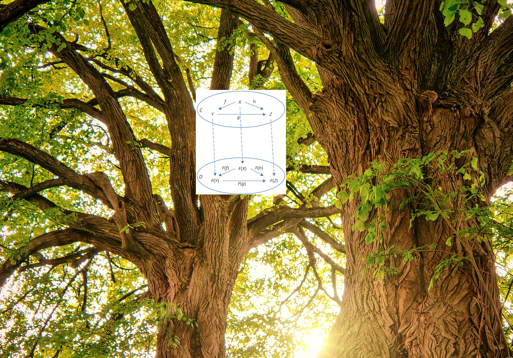

<!-- _transition: fade -->

---

<!-- _transition: fade -->

# What does the functor do on the tree?

---
<!-- _transition: fade -->

---

<!-- 

# Path for today

1) Model a `Tree` with `ADT`
 * what is a tree
 * normal people see birds or cats on trees
 * our trees are upside down
 * and if we have a really close look, we can see a functor on them
2) Identify the `Functor` on the `Tree`
3) Everyday `Tree` in IT
 * Source code
 * Filesystem and the `tree` command
4) Drawing our own tree
 * Goal: draw a timeline of WSUG
   * First just edition names + times
   * Then subtrees with topics and authors
   * Then sub-subtrees with author details like website or socials
 * Depth first - functional approach
 * Breadth-first - imperative
 * Compile it together
 * Homework: Okasaki structure for FP breadth-first -->

# Path for today

1) Model a `Tree` with `ADT`
2) Identify the `Functor` on the `Tree`
3) Everyday `Tree` in IT
4) Draw yourself a `Tree`

<!-- _transition: fade -->

---
<!-- _transition: fade -->

---
<!-- _transition: fade -->

---
<!-- _transition: fade -->

---
<!-- _transition: fade -->

---
<!-- _transition: fade -->

---

---

<!-- _transition: drop -->

---

