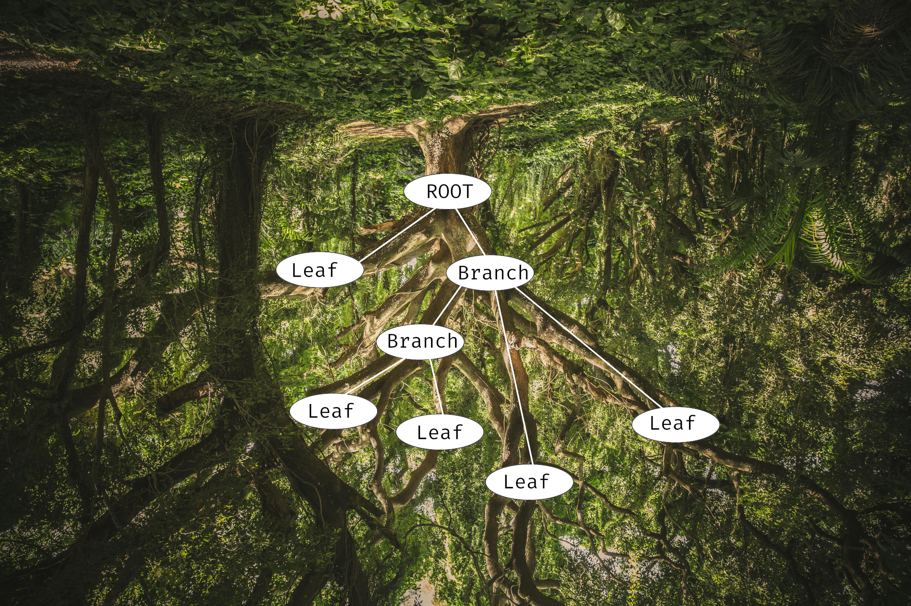
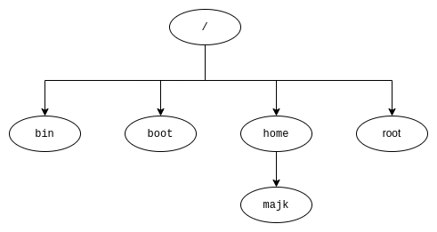
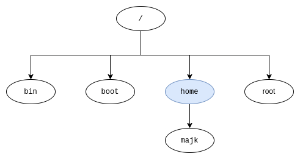

```scala mdoc:invisible
import scala.io.Source

def sourceFromFile(file: String, fromTo: (Int, Int)*) = println({
  if(fromTo.isEmpty) linesFromFile(file)
  else fromTo.flatMap { case (from, to) =>
    linesFromFile(file).zipWithIndex
      .filter { case (_, line) =>
        (line+1) >= from && (line+1) <= to
      }
      .map(_._1)
  }
}.mkString("```scala\n", "\n", "\n```"))

def linesFromFile(file: String) =
  Source.fromFile(file).getLines().toList
```


<!-- _transition: fade -->

---

<!-- _transition: fade -->


# What does the functor do on the tree?

<!-- 


# Path for today

1) Model a `Tree` with `ADT`
 * what is a tree
 * normal people see birds or cats on trees
 * our trees are upside down
 * and if we have a really close look, we can see a functor on them
2) Identify the `Functor` on the `Tree`
3) Everyday `Tree` in IT
 * Source code
 * Filesystem and the `tree` command
4) Drawing our own tree
 * Goal: draw a timeline of WSUG
   * First just edition names + times
   * Then subtrees with topics and authors
   * Then sub-subtrees with author details like website or socials
 * Depth first - functional approach
 * Breadth-first - imperative
 * Compile it together
 * Homework: Okasaki structure for FP breadth-first -->


<!-- 


# Path for today

1) Model a `Tree` with `ADT`
2) Identify the `Functor` on the `Tree`
3) Everyday `Tree` in IT
4) Draw yourself a `Tree` -->

<!-- _transition: fade -->


---
<!-- _transition: fade -->


---
<!-- _transition: fade -->

# When you go into the woods

you can spot...


---
<!-- _transition: fade -->


---
<!-- _transition: fade -->


---
<!-- _transition: fade -->

# But if you look **very** carefully


---
<!-- _transition: fade -->


---
<!-- _transition: fade -->


---


---

<!-- _transition: fade -->
<!-- _class: white-background -->

# Hi 👋 My name is Michał Pawlik


- Senior Software engineer @ SiriusXM
- Blog about Scala
- Occasional OSS

---

<!-- _transition: fade -->

# Tree


---

<!-- _transition: drop -->


---
<!-- _transition: fade -->


---

# That's better!



---

# Tree

<!-- _class: line-numbers -->

```scala mdoc:passthrough
sourceFromFile("code/src/main/scala/tree.scala", (4, 6))
```

---

# How's that useful?

---

# AST


---

# Databases 🌳

Self-balancing tree called *B-tree* is a popular way to implement indexing in databases


<!-- _footer: Source: https://www.geeksforgeeks.org/introduction-of-b-tree-2/ -->


---

# File system 🌳

- `/` is the `Root`
- Directories are branches
- Files are leaves

---

# Files tree

```bash
.
├── build.sbt
├── docs
│   └── markdown
│       ├── contributing
│       │   ├── how-it-works.md
│       │   ├── index.md
│       │   └── supporting-a-test-framework.md
│       ├── custom-types-support.md
│       └── supported-frameworks.md
├── LICENSE
├── modules
│   ├── core
│   ├── hashing
│   ├── munit
│   ├── plugin
│   ├── scalatest
│   └── weaver
├── project
│   ├── build.properties
│   ├── plugins.sbt
│   ├── project
│   └── Versions.scala
├── README.md
└── website
    ├── babel.config.js
    ├── docs
    ├── docusaurus.config.ts
    └── static
        └── img
            ├── favicon.ico
            ├── logo-large.png
            ├── logo-medium.png
            └── logo-small.png
```

---

# Wait that looked quite nice 🤔

---

# Wait that looked quite nice 🤔

How about we implement a renderer like this for our tree?

---

# Goal 🥅

Draw a tree of meetup editions with topics as sub-trees 🌳 and speaker info as leafs 🍀

<!-- TODO make a slide with showcasing the expected result -->

---

# Goal 🥅

```bash
 Wrocław Scala User Group
├── 📅 15.05.2024 Meeting #10
│  ├── 🎤 All the things that Metals doesn't do
│  │  └── 🧍 Katarzyna Marek 🌐 https://www.linkedin.com/in/katarzyna-marek-a74790193
│  └── 🎤 Grackle - Scala GraphQL Server
│     └── 🧍Rafał Piotrowski 🌐 https://www.linkedin.com/in/rafalpiotrowski
├── 📅 2.07.2024 Meeting #11
│  ├── 🎤 Human(o)IDs — designing IDs for both machines AND humans
│  │  └── 🧍 Jakub Wojnowski 🌐 https://www.linkedin.com/in/jakub-wojnowski
│  └── 🎤 Scala 3 features you probably haven't used (yet)
│     └── 🧍   Kacper Korban 🌐 https://www.linkedin.com/in/kacperfkorban
└── 📅 17.09.2024 Meeting #12
   ├── 🎤 What does the functor do on the tree?
   │  └── 🧍   Michał Pawlik 🌐 https://michal.pawlik.dev
   └── 🎤 Gearing towards Ox: A look at structured concurrency and direct style Scala
      └── 🧍   Tomasz Godzik 🌐 https://twitter.com/TomekGodzik
```

---

# But how 🤔

* Renderer capable of drawing **simple** structure
* Renderer capable of drawing **nested** structure
* Model meetup details
* Render tree with meetup details

---

# Renderer

<!-- _class: line-numbers -->

```scala mdoc:passthrough
sourceFromFile("code/src/main/scala/renderer.scala", (1, 3))
```
---

# Baby steps 👶

Let's start with drawing this:
```bash
/
├── bin
├── boot
├── etc
├── home
├── root
├── usr
└── var
```

---

# Test


```scala mdoc:passthrough
sourceFromFile("code/src/test/scala/RendererV1Test.scala", (12, 33))
```

---

# Snapshot4s 📸

https://github.com/siriusxm/snapshot4s


---

# Renderer

<!-- _class: line-numbers -->

```scala mdoc:passthrough
sourceFromFile("code/src/main/scala/RendererV1.scala", (6, 17))
```

---

# Let's test it!

---

# Snapshot test result

```diff
Snapshot not equal
=> Obtained
/
├── bin
├── boot
├── etc
├── home
├── root
├── usr
├── var
=> Diff (- obtained, + expected)
 ├── usr
-├── var
+└── var
```

---

# The missing `└──`

---


# Renderer

<!-- _class: line-numbers -->

```scala mdoc:passthrough
sourceFromFile("code/src/main/scala/RendererV1.scala", (6, 17))
```


---

# RendererV2

<!-- _class: line-numbers -->

```scala mdoc:passthrough
sourceFromFile("code/src/main/scala/RendererV2.scala", (6, 25))
```

---

# Test again


```scala mdoc:passthrough
sourceFromFile("code/src/test/scala/RendererV2Test.scala", (12, 32))
```

---

# So far so good!

```bash
RendererV2Test:
  + should render a simple tree 0.266s
```

---

# Nesting 🪜

Can we handle nested structures?

---

# Nesting 🪜

Can we handle nested structures?

```bash
/
├── bin
├── boot
├── etc
├── home
│   └── majk
├── root
├── usr
└── var
```

---

# Let's test it

```scala
test("should render one level tree") {
  val oneLevelTree: Tree[String] =
    Branch(
      "/",
      NonEmptyList
        .of(
          Leaf("bin"), /*...*/,
          Branch("home", NonEmptyList.one(Leaf("majk"))),
          /*...*/Leaf("var")
        )
    )
  assertInlineSnapshot(
    renderer.render(oneLevelTree),
    """/
      |├── bin
      |├── boot
      |├── etc
      |├── home
      |│   └── majk
      |├── root
      |├── usr
      |└── var""".stripMargin
  )
}
```

---

# Not quite!

```diff
Snapshot not equal
=> Obtained
/
├── bin
├── boot
├── etc
home
└── majk
├── root
├── usr
└── var
=> Diff (- obtained, + expected)
 ├── etc
-home
-└── majk
+├── home
+│   └── majk
 ├── root
```

---

# Why doesn't it work? 🤔

---

# Depth-first search


<!-- _footer: Source: https://en.wikipedia.org/wiki/Depth-first_search -->

<!-- draw the tree from the example above and show how when visiting `majk` leaf we don't know if there are other nodes on the upper level -->


---

# Depth-first search

<!-- _class: line-numbers -->

```scala mdoc:passthrough
sourceFromFile("code/src/main/scala/RendererV1.scala", (6, 17))
```


<!-- _footer: Source: https://en.wikipedia.org/wiki/Depth-first_search -->

<!-- draw the tree from the example above and show how when visiting `majk` leaf we don't know if there are other nodes on the upper level -->


---

# Is this strategy good enough anyway?

---
<!-- _transition: fade -->
# Step by step

Let's do depth first search on a simplified tree

```bash
/
├── bin
├── boot
├── home
│   └── majk
└── root
```



---
<!-- _transition: fade -->
# Step by step

```bash
/
├── bin
...
```


---
<!-- _transition: fade -->
# Step by step

```bash
/
├── bin
├── boot
...
```


---
<!-- _transition: fade -->
# Step by step

```bash
/
├── bin
├── boot
├── home
...
```



---

# Step by step

```bash
/
├── bin
├── boot
❓─ home
❓  └── majk
```
🤔 what should the first character be?


---

# Limitations of DFS

* We want to draw trees in depth-first manner, but we lack information about the structure
* We need to learn the tree width first, before deciding how to print nodes

---

# Breadth-first search

**Black:** explored

**Grey:** queued to be explored later on

* You got this right, we're introducing a mutable queue!


<!-- _footer: Source https://en.wikipedia.org/wiki/Breadth-first_search -->

---

# Basic BFS

```scala mdoc:passthrough
sourceFromFile("code/src/main/scala/BFS.scala", (7, 12))
```
🙈
```scala mdoc:passthrough
sourceFromFile("code/src/main/scala/BFS.scala", (21, 22))
```

---

# Basic BFS

<!-- _class: line-numbers -->

```scala mdoc:passthrough
sourceFromFile("code/src/main/scala/BFS.scala", (8, 23))
```

---

# Let's test it

For our test tree

```bash
/
├── bin
├── boot
├── etc
├── home
│   └── majk
├── root
├── usr
└── var
```

---

# Let's see it in action

```scala
sbt:root> testOnly *BFS*
Visiting     /, queue: Queue()
Visiting   bin, queue: Queue(boot, etc, home, root, usr, var)
Visiting  boot, queue: Queue(etc, home, root, usr, var)
Visiting   etc, queue: Queue(home, root, usr, var)
Visiting  home, queue: Queue(root, usr, var)
Visiting  root, queue: Queue(usr, var, majk)
Visiting   usr, queue: Queue(var, majk)
Visiting   var, queue: Queue(majk)
Visiting  majk, queue: Queue()
BFSTest:
  + should visit nodes in expected order 0.124s
[info] Passed: Total 1, Failed 0, Errors 0, Passed 1
```

---

# So far so good, ordering makes sense

Now let's attach some info along the way

---

# Node positioning

Here's what we expect

```bash
/
├── bin         | First
├── boot        | Middle
├── etc         | Middle
├── home        | Middle
│   └── majk    | Middle -> Last
├── root        | Middle
├── usr         | Middle
└── var         | Last
```

---

# Node positioning

```scala mdoc:passthrough
sourceFromFile("code/src/main/scala/BFS.scala", (25, 29))
```

---

# Node positioning

```scala mdoc:passthrough
sourceFromFile("code/src/main/scala/BFS.scala", (25, 29))
```

```scala mdoc:passthrough
sourceFromFile("code/src/main/scala/BFSExtended.scala", (10,10))
```

---

# Extended queue and result type

```scala mdoc:passthrough
sourceFromFile("code/src/main/scala/BFSExtended.scala", (10,14))
```

```scala mdoc:passthrough
sourceFromFile("code/src/main/scala/BFSExtended.scala", (24,25))
```


---

# Extended queue and result type

```scala mdoc:passthrough
sourceFromFile("code/src/main/scala/BFSExtended.scala", (14,23))
```

---

# Let's test it

For our test tree

```bash
/
├── bin         | First
├── boot        | Middle
├── etc         | Middle
├── home        | Middle
│   └── majk    | Middle -> Last
├── root        | Middle
├── usr         | Middle
└── var         | Last
```

---

# Let's test it

```scala mdoc:passthrough
sourceFromFile("code/src/test/scala/BFSTest.scala", (63, 79))
```

<!-- NOTE: we are not handling duplicates here, that's a bonus question -->

---

# Works like a charm

```scala
BFSTest:
  + should visit nodes in expected order 0.078s
  + should produce paddings 0.018s
  + should produce extended alignments 0.007s
```

---

# We are ready

---

# We are ready

- First do BFS to learn the structure, 
- Then DFS to draw in correct order

---
<!-- _class: line-numbers -->
# `RendererV3` implementation

```scala mdoc:passthrough
sourceFromFile("code/src/main/scala/RendererV3.scala", (5, 10), (43, 43))
```

---
<!-- _class: line-numbers -->
# `RendererV3` implementation

```scala mdoc:passthrough
sourceFromFile("code/src/main/scala/RendererV3.scala", (12, 27))
```

---
<!-- _class: line-numbers -->
# `RendererV3` implementation


```scala mdoc:passthrough
sourceFromFile("code/src/main/scala/RendererV3.scala", (29, 41))
```

---


# Final challenge


---

# Model the data 


```scala mdoc:passthrough
sourceFromFile("code/src/main/scala/meetup.scala", (3, 11))
```

---

# Tree of `String`

* We know how to print `Tree[String]`
* We need to turn `Tree[Event | Talk | Speaker | String]` into `Tree[String]`


---

# Do you know what time it is? 🕔

<!-- _transition: drop -->

---

## No, not the lunch break yet 🌯 🍲

---

<!-- _transition: drop -->

# It's time for...

---

<!-- _transition: drop -->


# The F word

---

# Functor

---

# Functor

Provided we have `Event | Talk | Speaker| String => String`

Functor can turn `Tree[Event | Talk | Speaker | String]` into `Tree[String]`

---


# `Functor[F[_]]` on a `Tree[A]` 🌳

---


# `Functor` on a `Tree[A]` 🌳

<!-- _class: line-numbers -->

```scala mdoc:passthrough
sourceFromFile("code/src/main/scala/tree.scala", (12, 24))
```
---

# `Functor[F[_]]` on a `Tree[A]` 🌳

Functor can turn `Tree[Event | Talk | Speaker | String]` into `Tree[String]`

```scala mdoc:passthrough
sourceFromFile("code/src/test/scala/MeetupTest.scala", (52, 58))
```
```scala mdoc:passthrough
sourceFromFile("code/src/test/scala/MeetupTest.scala", (62, 62), (90, 90))
```
---

# `Functor[F[_]]` on a `Tree[A]` 🌳

```scala mdoc:passthrough
sourceFromFile("code/src/test/scala/MeetupTest.scala", (62, 89))
```

---
<!-- _transition: fade -->

# Final result


---
<!-- _transition: fade -->

# Final result

```bash
 Wrocław Scala User Group
├── 📅 15.05.2024 Meeting #10
│  ├── 🎤 All the things that Metals doesn't do
│  │  └── 🧍 Katarzyna Marek 🌐 https://www.linkedin.com/in/katarzyna-marek-a74790193
│  └── 🎤 Grackle - Scala GraphQL Server
│     └── 🧍Rafał Piotrowski 🌐 https://www.linkedin.com/in/rafalpiotrowski
├── 📅 2.07.2024 Meeting #11
│  ├── 🎤 Human(o)IDs — designing IDs for both machines AND humans
│  │  └── 🧍 Jakub Wojnowski 🌐 https://www.linkedin.com/in/jakub-wojnowski
│  └── 🎤 Scala 3 features you probably haven't used (yet)
│     └── 🧍   Kacper Korban 🌐 https://www.linkedin.com/in/kacperfkorban
└── 📅 17.09.2024 Meeting #12
   ├── 🎤 What does the functor do on the tree?
   │  └── 🧍   Michał Pawlik 🌐 https://michal.pawlik.dev
   └── 🎤 Gearing towards Ox: A look at structured concurrency and direct style Scala
      └── 🧍   Tomasz Godzik 🌐 https://twitter.com/TomekGodzik
```


---
<!-- _transition: fade -->

# Takeaways


---
<!-- _transition: drop -->

# It's not FP vs OOP


---
<!-- _transition: fade -->

# It's FP and OOP!

* With Scala you get the best of both worlds 🌍
* Choose the right tools for the problem 🧰


---
<!-- _transition: fade -->


# Thank you!

<style scoped>
/* Styling for centering (required in default theme) */
h1, h2, h3, h4, h5, p, ul, li {
  text-align: center;
}
</style>

Blog: [blog.michal.pawlik.dev](https://blog.michal.pawlik.dev)
Linkedin: [Michał Pawlik](https://www.linkedin.com/in/michał-pawlik/)
Github: [majk-p](https://github.com/majk-p)
Bluesky: [@michal.pawlik.dev](https://bsky.app/profile/michal.pawlik.dev)

Get in touch! 👋


---

# Bonus
<!-- _transition: fade -->


- B-trees https://planetscale.com/blog/btrees-and-database-indexes
- Purely functional data structures
  - BFS https://www.cs.tufts.edu/~nr/cs257/archive/chris-okasaki/breadth-first.pdf
  - https://cstheory.stackexchange.com/questions/1539/whats-new-in-purely-functional-data-structures-since-okasaki
